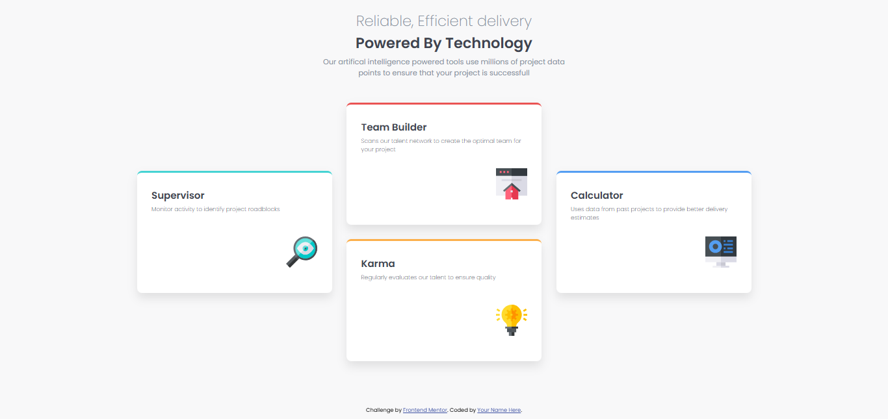

# Frontend Mentor - Four card feature section solution

This is a solution to the [Four card feature section challenge on Frontend Mentor](https://www.frontendmentor.io/challenges/four-card-feature-section-weK1eFYK). Frontend Mentor challenges help you improve your coding skills by building realistic projects. 

## Table of contents

- [Overview](#overview)
  - [The challenge](#the-challenge)
  - [Screenshot](#screenshot)
  - [Links](#links)
- [My process](#my-process)
  - [Built with](#built-with)
  - [What I learned](#what-i-learned)
  - [Continued development](#continued-development)
  - [Useful resources](#useful-resources)
- [Author](#author)

## Overview

### The challenge

Users should be able to:

- View the optimal layout for the site depending on their device's screen size

### Screenshot



### Links

- Solution URL: (https://github.com/abdisavia/Frontend-Mentor---Four-card-feature-section-solution)

## My process

### Built with

- Semantic HTML5 markup
- CSS custom properties
- CSS Grid
- Mobile-first workflow

### What I learned

in this project i try to implementing semantic HTML specially to card component. in this project i'm using unorder list or (<ul></ul> tag) for listing all the project data points. i'm using list because based on english dictionary list is a record of short pieces of information, so because all the project data points in this project have short pieces of information i decided to use <ul></ul> tag.

```html
  <ul class="cards">
      <li class="card">
        <h2>Supervisor</h2>
        <p>Monitor activity to identify project roadblocks</p>
        
      </li>
      <li>
        <ul class="middleCards">
          <li class="card">
            <h2>Team Builder</h2>
            <p>Scans our talent network to create the optimal team for your project</p>
            
          </li>
          <li class="card">
            <h2>Karma</h2>
            <p>Regularly evaluates our talent to ensure quality</p>
            
          </li>  
        </ul>
      </li>
      <li class="card">
        <h2>Calculator</h2>
        <p>Uses data from past projects to provide better delivery estimates</p>
        
      </li>
  </ul>
```
```css
//using pseudoclass for make unique card border color
.cards > .card:nth-child(1){
    border-top: 4px solid hsl(180, 62%, 55%);
}

.cards > .card:nth-child(3){
    border-top: 4px solid hsl(212, 86%, 64%);
}

.middleCards > .card:nth-child(1){
    border-top: 4px solid hsl(0, 78%, 62%);
}
.middleCards > .card:nth-child(2){
    border-top: 4px solid hsl(34, 97%, 64%);
}

//using @media rule for implementing responsive design
@media (max-width: 900px){
   main{
    width:90%;
    padding:10px;
   }
   .cards{
    grid-template-columns: repeat(1, 1fr);
   }
   .card{
    width:100%;
   }
   .definition{
    width:100%;    
   }
   .middleCards{
    grid-template-columns: repeat(1, 1fr);
   }
}   
```

### Continued development
In future project i want to more often implement semantic HTML for making my code easily to read.

### Useful resources

- [w3schools](https://www.w3schools.com) - This helped me for learning how to use css for responsive user interface. I really liked this pattern and will use it going forward.
- [stackoverflow](https://www.stackoverflow.com) - This is an amazing article which helped me finally understand simillar problem and how to solved it.
- [vscodeagent] - this really help me for completing this project faster.


## Author
- Frontend Mentor - [@abdisavia](https://www.frontendmentor.io/profile/abdisavia)
- Instagram - [@abdisavia_](https://www.twitter.com/abdisavia_)

